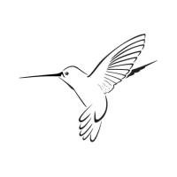

# Talawa API

[](https://github.com/PalisadoesFoundation/talawa)

Talawa is a modular open source project to manage group activities of both non-profit organizations and businesses.

Core features to be developed include:

 1. Membership management
 2. Groups management
 3. Event registrations
 4. Recurring meetings
 5. Facilities registrations

This has been a Calico Challenge project in 2019. It will be written in python with close integrations with the Plone open source content management system.

# Documentation
 - The talawa documentation can be found [here][readthedocs].
 - Visit the [talawa GitHub site][repo] to see the code.

# About Talawa
 
 ``talawa`` is based on the original ``quito`` code created by the [Palisadoes Foundation][pfd] as part of its annual Calico Challenge program. Calico provides paid summer internships for  Jamaican university students to work on selected open source projects. They are mentored by software professionals and receive stipends based on the completion of predefined milestones. Calico was started in 2015.
 
# Installation
## Prerequesites
Talawa API development prerequisites
- [Node v12.14.1 (or later)][node]

Clone and change into the project
```sh
$ git clone https://github.com/PalisadoesFoundation/talawa-api.git
$ cd talawa-api
```

Install packages
```sh
$ npm install
```
To run the project in development mode, run the following command
```sh
$ npm run start
```
For testing, run the following command
```sh
$ npm run test
```
Start developing!

 
[readthedocs]: <https://talawa.readthedocs.io/>
[repo]: <https://github.com/PalisadoesFoundation/talawa>
[pfd]: <http://www.palisadoes.org>
[node]: <https://nodejs.org/en/>
[yarn]: <https://yarnpkg.com/>


ENVIRONMENT VARIABLES  
To run this api five environment variables need to be set:  
MONGO_USER  
MONGO_PASSWORD  
MONGO_DB  
ACCESS_TOKEN_SECRET  
REFRESH_TOKEN_SECRET  